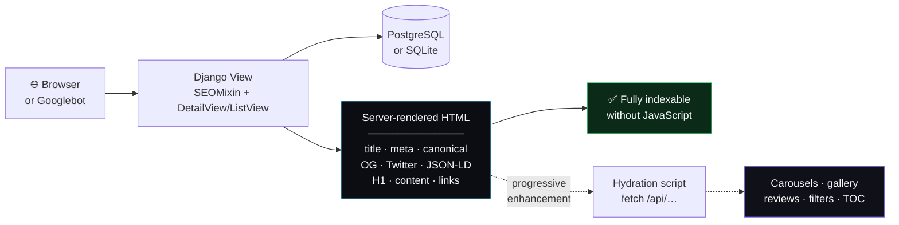
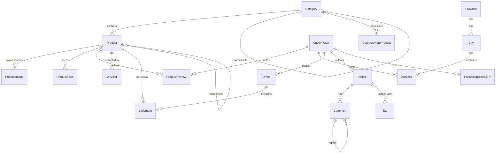
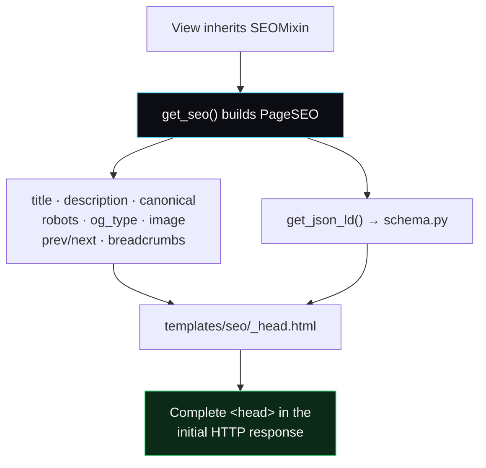

<div align="center">

# ⚡ NeX Go

### Premium Electric Scooter Store — فروشگاه اسکوتر برقی

A production-grade, **SEO-first** Django e-commerce platform for premium electric scooters.<br>
Fully **Persian (fa-IR)** and **RTL**, server-rendered, with a REST API for progressive hydration.

<br>

[](https://www.python.org/)
[](https://www.djangoproject.com/)
[](https://www.django-rest-framework.org/)
[](https://www.postgresql.org/)

[](#-testing)
[](#-seo-architecture)
[](#structured-data-jsonld)
[](#-internationalisation)
[](#-license)

<br>

[Overview](#-overview) · [Features](#-features) · [Quick Start](#-quick-start) · [Environments](#-environment-configuration) · [API](#-api-reference) · [SEO](#-seo-architecture) · [Deploy](#-deployment)

</div>

---

## 📖 Overview

NeX Go is a full-stack Django storefront for selling electric scooters in the Iranian market. It ships
a **product catalogue**, a **content magazine**, **user accounts with OTP password reset**, and a
**Persian-language admin** — all wrapped in an SEO layer that renders every crawlable signal on the
server.

### How the site works

Every public page follows the same **server-render → hydrate** pattern:



**The key idea:** the HTML that leaves the server is already complete. A crawler that never executes a
line of JavaScript still sees the product name, price, description, breadcrumbs, structured data and
every internal link. JavaScript then layers on the interactive parts — carousels, colour-variant
galleries, review pagination, client-side filters, article tables of contents.

> [!NOTE]
> This is deliberate. The pages were originally empty shells whose metadata was injected by JS after an
> API round-trip — invisible to non-rendering crawlers and unreliable for the rest. See
> [SEO Architecture](#-seo-architecture) for what changed and why.

---

## ✨ Features

<table>
<tr><td width="50%" valign="top">

### 🛒 Storefront
- Nested **categories** with hero sliders per category
- **Product pages** with specs, trust badges, marketing blocks and stat rows
- **Colour-variant galleries** (`ProductImage` per colour with hex + label)
- **Discount pricing** with strike-through original
- **Stock states** — in stock / restocking / discontinued
- Paginated, filterable, sortable listings
- **Related products** surfaced on out-of-stock pages

</td><td width="50%" valign="top">

### 👤 Accounts
- Custom user model — login by **username *or* mobile**
- **OTP password reset** (SHA-256 hashed codes, expiry, attempt limits)
- Profile with avatar, bio, national code, birth date, gender
- **Address book** with Iranian province/city cascade
- **Wishlist** across sessions
- User dashboard + admin dashboards

</td></tr>
<tr><td width="50%" valign="top">

### ⭐ Reviews & Community
- Product reviews with **moderation workflow**
  (`pending` → `approved` / `rejected` + reason)
- Star ratings, rating distribution, helpful counts
- **Verified purchase** flag
- Threaded article comments with approval
- `AggregateRating` schema emitted **only** when real
  approved reviews exist

</td><td width="50%" valign="top">

### 📰 Magazine
- Rich-text articles (CKEditor) with tags
- Auto-generated **excerpt**, **meta description** and
  **reading time**
- Cover images with dimension caching
- Attachments — image / video / audio / PDF with
  magic-byte validation
- Auto table of contents, share links, related posts
- Per-article **canonical override** for syndication

</td></tr>
<tr><td width="50%" valign="top">

### 🎛️ Content Management
- **Jazzmin** Persian admin UI
- `IndexPageSettings` — singleton controlling the entire
  homepage: hero copy, stats, section titles, footer
- Editable **testimonials**, **promises**, **product cards**
  and **category features**
- Per-category hero product sliders
- Review moderation screens

</td><td width="50%" valign="top">

### 🔍 SEO & Performance
- Server-rendered meta, canonical, OG, Twitter, JSON-LD
- **Sitemap index** + 4 sections with `lastmod`
- Template-driven `robots.txt`
- Self-hosted fonts, pre-compiled Tailwind, bundled CSS
- Anonymous page cache with **version-based invalidation**
- WhiteNoise + hashed static filenames

</td></tr>
</table>

---

## 🧰 Tech Stack

| Layer | Technology | Purpose |
|:--|:--|:--|
| **Runtime** | Python 3.11 | — |
| **Framework** | Django 4.2 LTS | Core web framework |
| **API** | Django REST Framework 3.17 | JSON endpoints for hydration |
| **API Docs** | drf-spectacular | OpenAPI 3 schema, Swagger UI, ReDoc |
| **Database** | PostgreSQL (prod) · SQLite (dev) | Persistence |
| **Admin** | django-jazzmin | Persian-localised admin theme |
| **Editor** | django-ckeditor | Rich text for articles |
| **Static** | WhiteNoise + ManifestStaticFilesStorage | Hashed filenames, 1-year immutable caching |
| **Assets** | django-compressor | CSS bundling + minification |
| **Config** | python-decouple | Explicit `.env` file loading |
| **Images** | Pillow | Upload processing, dimension caching |
| **CORS** | django-cors-headers | Cross-origin control |

---

## 📁 Project Structure

```
scooter-website/
├── config/                     # Project configuration
│   ├── settings.py             #   ⚙️  Two environment switches live here
│   ├── settings_test.py        #   Test overrides (SQLite, fast hashers)
│   ├── urls.py                 #   Root URLconf + sitemaps + legacy redirects
│   └── jazzmin.py              #   Admin theme configuration
│
├── apps/
│   ├── accounts/               # 👤 Users, auth, OTP reset, addresses, geo
│   ├── shop/                   # 🛒 Categories, products, reviews, wishlist, orders
│   ├── home/                   # 📰 Articles, comments, tags, homepage CMS
│   └── seo/                    # 🔍 The SEO layer (see below)
│       ├── seo.py              #   PageSEO dataclass + SEOMixin
│       ├── schema.py           #   Schema.org JSON-LD builders
│       ├── sitemaps.py         #   Sitemap classes
│       ├── middleware.py       #   URL canonicalisation + cache/robots headers
│       ├── cache.py            #   Anonymous-only page cache
│       ├── signals.py          #   Cache invalidation on content save
│       ├── utils.py            #   Canonical URLs, meta truncation
│       ├── templatetags/       #   json_ld, img_dimensions, meta_text
│       └── management/commands/backfill_seo_data.py
│
├── templates/                  # Project-level templates
│   ├── seo/_head.html          #   ⭐ Single source of truth for <head> metadata
│   ├── seo/_fonts.html         #   Self-hosted font loading + preload
│   ├── seo/_page_base.html     #   Base for static pages
│   ├── seo/about.html
│   ├── seo/contact.html
│   ├── seo/robots.txt
│   ├── 404.html                #   Real 404 with navigation
│   └── 500.html
│
├── static/
│   ├── fonts/                  # 44 self-hosted woff2 files
│   ├── css/                    # fonts.css · article.css · dashboard.css
│   └── images/                 # logo · favicon · OG default · placeholders
│
├── tools/tailwind/             # Tailwind build config (output is committed)
├── provinces_and_cities/       # Iranian province/city seed data
├── tests/                      # Security-focused test suite
│
├── .env.example                # ✅ Committed template — no secrets
├── .env.dev                    # 🚫 Gitignored — local development
├── .env.prod                   # 🚫 Gitignored — production
└── requirements.txt
```

---

## 🚀 Quick Start

### Prerequisites

- **Python 3.11+**
- **Git**
- PostgreSQL 14+ *(production only — development uses SQLite)*

### Installation

```bash
# 1 — Clone
git clone <repository-url>
cd scooter-website

# 2 — Virtual environment
python -m venv venv
source venv/bin/activate          # Windows: venv\Scripts\activate

# 3 — Dependencies
pip install -r requirements.txt

# 4 — Environment file
cp .env.example .env.dev
#    Then set SECRET_KEY. Generate one with:
python -c "from django.core.management.utils import get_random_secret_key as k; print(k())"

# 5 — Database (SQLite, created automatically)
python manage.py migrate

# 6 — Admin user
python manage.py createsuperuser

# 7 — Optional: seed Iranian provinces & cities
python provinces_and_cities/import_data.py

# 8 — Run
python manage.py runserver
```

Open **<http://127.0.0.1:8000>** — admin at **<http://127.0.0.1:8000/admin/>**.

<details>
<summary><b>Minimum <code>.env.dev</code> to get running</b></summary>

```ini
SECRET_KEY=<paste-the-generated-key>
DEBUG=True
ALLOWED_HOSTS=localhost,127.0.0.1,[::1],testserver
SITE_URL=http://127.0.0.1:8000
SECURE_SSL_REDIRECT=False
SECURE_HSTS_SECONDS=0
COMPRESS_ENABLED=False
```

No `DB_*` variables are needed — the development SQLite block ignores them.

</details>

---

## ⚙️ Environment Configuration

The project uses **two explicit environment files** and **two switches** in `config/settings.py`.
There is no automatic environment detection: what runs is always visible in the diff.

| File | Purpose | Git |
|:--|:--|:--|
| `.env.example` | Placeholder template, all variable names | ✅ tracked |
| `.env.dev` | Local development — SQLite | 🚫 ignored |
| `.env.prod` | Production — PostgreSQL | 🚫 ignored |

### Switching environments

Flip **both** markers together in `config/settings.py` (lines **32** and **230**):

<table>
<tr><th width="50%">🟢 Development <sub>(default)</sub></th><th width="50%">🔴 Production</th></tr>
<tr><td>

```python
# ── SWITCH 1 of 2 ── (line 32)
ENV_FILE = BASE_DIR / '.env.dev'
# ENV_FILE = BASE_DIR / '.env.prod'

# ── SWITCH 2 of 2 ── (line 230)
DATABASES = {
    'default': {
        'ENGINE': '…backends.sqlite3',
        'NAME': BASE_DIR / 'db.sqlite3',
    }
}
# DATABASES = { …postgresql… }
```

</td><td>

```python
# ── SWITCH 1 of 2 ── (line 32)
# ENV_FILE = BASE_DIR / '.env.dev'
ENV_FILE = BASE_DIR / '.env.prod'

# ── SWITCH 2 of 2 ── (line 230)
# DATABASES = { …sqlite3… }

DATABASES = {
    'default': {
        'ENGINE': '…backends.postgresql',
        'NAME': config('DB_NAME'), …
    }
}
```

</td></tr>
</table>

> [!TIP]
> Real environment variables **take precedence** over the file. A container or systemd unit can
> override any single value with `-e DB_PASSWORD=…` without editing anything.

<details>
<summary><b>Full environment variable reference</b></summary>

| Variable | Default | Description |
|:--|:--|:--|
| `SECRET_KEY` | — *(required)* | Django cryptographic key |
| `DEBUG` | `False` | Never `True` in production |
| `ALLOWED_HOSTS` | `''` | **Required** when `DEBUG=False`, else every request 400s |
| `CSRF_TRUSTED_ORIGINS` | `''` | Required behind HTTPS |
| `DB_NAME` / `DB_USER` / `DB_PASSWORD` / `DB_HOST` / `DB_PORT` | — | PostgreSQL only |
| `DB_CONN_MAX_AGE` | `60` | Connection reuse (seconds) |
| `LANGUAGE_CODE` | `fa` | Set `en-us` for an English admin |
| `TIME_ZONE` | `Asia/Tehran` | — |
| `SITE_URL` | *(from request)* | Canonical origin for canonicals, OG, sitemaps, JSON-LD |
| `SITE_NAME` | `NeX Go` | Brand suffix in titles |
| `SEO_TWITTER_SITE` | `''` | `@handle` for Twitter cards |
| `ORG_LEGAL_NAME` / `ORG_EMAIL` / `ORG_PHONE` | — | Organization JSON-LD |
| `ORG_SOCIAL_PROFILES` | `''` | Comma-separated → `sameAs` |
| `STORE_STREET` / `STORE_CITY` / `STORE_REGION` / `STORE_POSTAL_CODE` | — | Store JSON-LD on `/contact/` |
| `STORE_LATITUDE` / `STORE_LONGITUDE` | — | `GeoCoordinates` |
| `SECURE_SSL_REDIRECT` | `not DEBUG` | Turn off only if the proxy omits `X-Forwarded-Proto` |
| `SECURE_HSTS_SECONDS` | `31536000` | `0` in development |
| `PREPEND_WWW` | `False` | apex → www redirect |
| `COMPRESS_ENABLED` | `not DEBUG` | CSS bundling |
| `SEO_PAGE_CACHE_SECONDS` | `300` | Anonymous page cache TTL |
| `CACHE_BACKEND` / `CACHE_LOCATION` | LocMem | Point at Redis in production |
| `GOOGLE_CLIENT_ID` / `GOOGLE_CLIENT_SECRET` | — | Reserved for OAuth *(not yet wired up)* |

</details>

---

## 🗺️ URL Map

### Public pages

| Route | Name | Description |
|:--|:--|:--|
| `/` | `home_app:index` | Homepage — full-screen slide deck |
| `/shop/` | `shop_app:product_list` | All products, paginated |
| `/shop/category/<slug>/` | `shop_app:category_products` | Category listing + hero slider |
| `/shop/product/<slug>/` | `shop_app:product_detail` | Product detail |
| `/articles/` | `home_app:articles` | Magazine index |
| `/articles/<slug>/` | `home_app:article_detail` | Article |
| `/about/` | `seo:about` | About + FAQ |
| `/contact/` | `seo:contact` | Contact + showroom |

### Accounts

| Route | Name |
|:--|:--|
| `/accounts/register/` | `accounts_app:register` |
| `/accounts/login/` | `accounts_app:login` |
| `/accounts/logout/` | `accounts_app:logout` |
| `/accounts/dashboard/` | `accounts_app:dashboard` |
| `/accounts/password-reset/` | `accounts_app:password_reset` |

### Machine-readable

| Route | Description |
|:--|:--|
| `/robots.txt` | Crawl rules + sitemap pointer |
| `/sitemap.xml` | Sitemap index |
| `/sitemap-{static,categories,products,articles}.xml` | Sections, auto-paginated past 25 000 URLs |
| `/api/schema/` | OpenAPI 3 schema *(staff only)* |
| `/api/docs/` · `/api/redoc/` | Swagger UI · ReDoc *(staff only)* |

### 301 redirects

Legacy and mistyped paths are permanently redirected rather than 404ing:
`/products/` `/models/` `/collection/` → `/shop/` · `/blog/` `/guide/` → `/articles/` ·
`/register/` `/login/` `/dashboard/` → `/accounts/…` · `/product/<slug>/` → `/shop/product/<slug>/` ·
`/shop/<slug>/` → `/shop/product/<slug>/` · mixed-case URLs → lowercase.

---

## 🔌 API Reference

All endpoints return JSON and carry `X-Robots-Tag: noindex, nofollow`.

<details>
<summary><b>🛒 Shop</b></summary>

| Method | Endpoint | Auth | Description |
|:--|:--|:--|:--|
| `GET` | `/shop/api/products/` | public | List — `?search=` `?category=` `?min_price=` `?max_price=` `?sort=` |
| `GET` | `/shop/api/products/<slug>/` | public | Product detail *(increments view count)* |
| `GET` | `/shop/api/categories/` | public | Root categories |
| `GET` | `/shop/api/category/<slug>/` | public | Category + hero products + products |
| `GET` | `/shop/api/products/<slug>/reviews/` | public | Approved reviews |
| `POST` | `/shop/api/products/<slug>/reviews/` | 🔒 user | Submit a review *(10/hour)* |
| `GET` | `/shop/api/wishlist/` | 🔒 user | Wishlist |
| `POST` | `/shop/api/wishlist/toggle/` | 🔒 user | Toggle by `product_id` |
| `POST` | `/shop/api/products/<slug>/wishlist/` | 🔒 user | Toggle by slug |

`sort` accepts `price` · `-price` · `created_at` · `-created_at` · `view_count` · `-view_count`.

</details>

<details>
<summary><b>📰 Content</b></summary>

| Method | Endpoint | Auth | Description |
|:--|:--|:--|:--|
| `GET` | `/api/index/` | public | Homepage CMS payload |
| `GET` | `/api/articles/` | public | List — `?search=` `?tag=` `?page=` |
| `GET` | `/api/articles/<slug>/` | public | Article detail |
| `GET` | `/api/tags/` | public | Tags with published articles |
| `GET` | `/api/articles/<slug>/comments/` | public | Approved comments |
| `POST` | `/api/articles/<slug>/comments/` | 🔒 user | Post a comment *(20/hour)* |

</details>

<details>
<summary><b>👤 Accounts</b></summary>

| Method | Endpoint | Auth | Description |
|:--|:--|:--|:--|
| `POST` | `/accounts/api/register/` | public | Register *(10/hour)* |
| `POST` | `/accounts/api/login/` | public | Login by username or mobile *(5/min)* |
| `POST` | `/accounts/api/password-reset/request/` | public | Send OTP *(3/hour)* |
| `POST` | `/accounts/api/password-reset/verify/` | public | Verify OTP *(10/hour)* |
| `POST` | `/accounts/api/password-reset/confirm/` | public | Set new password *(5/hour)* |
| `POST` | `/accounts/api/change-password/` | 🔒 user | Change password *(10/hour)* |
| `GET` | `/accounts/api/dashboard/` | 🔒 user | Dashboard data |
| `PATCH` | `/accounts/api/profile/update/` | 🔒 user | Update profile *(20/hour)* |
| `GET`/`POST` | `/accounts/api/addresses/` | 🔒 user | List / create address |
| `DELETE` | `/accounts/api/addresses/<pk>/delete/` | 🔒 user | Delete address |
| `GET` | `/accounts/api/provinces/` · `/cities/?province=` | public | Geo cascade |

</details>

> [!IMPORTANT]
> DRF's default permission is **`IsAuthenticated`** — endpoints fail *closed*. Public views declare
> `AllowAny` explicitly, so a view that forgets a permission class is never accidentally exposed.

---

## 🗃️ Data Model



<details>
<summary><b>Model inventory</b></summary>

| App | Models |
|:--|:--|
| **shop** | `Category` · `Product` · `ProductSpec` · `ProductImage` · `TrustBadge` · `MarketingFeature` · `StatFeature` · `ProductReview` · `Wishlist` · `CategoryHeroProduct` · `Order` · `OrderItem` |
| **home** | `Article` · `Tag` · `Comment` · `IndexPageSettings` · `CategoryFeature` · `ProductCard` · `Testimonial` · `Promise` |
| **accounts** | `CustomUser` · `PasswordResetOTP` · `Province` · `City` · `Address` |

**Notable fields on `Product`:** `sku` (auto `VLX-00001`), `brand`, `mpn`, `is_discontinued`,
`replacement_product`, `restock_expected`, `meta_title`, `meta_description`, plus cached
`cover_image_width` / `cover_image_height` for layout stability.

</details>

---

## 🔍 SEO Architecture

The `apps/seo` app is the centrepiece. Every crawlable signal is produced **server-side** from one
source of truth.

### The pipeline



Adding SEO to a new page means overriding `seo_title`, `seo_description`, `get_breadcrumbs()` and
`get_json_ld()` — never editing `<head>` markup. No template can drift out of sync.

### Structured data (JSON-LD)

| Schema | Where | Notes |
|:--|:--|:--|
| `Organization` | Homepage, About | Logo, contact point, `sameAs` profiles |
| `WebSite` | Homepage | `SearchAction` deliberately omitted — site search isn't indexed |
| `Product` | Product pages | SKU, brand, offer, price, currency, availability, condition |
| `AggregateRating` | Product pages | **Only** when real approved reviews exist |
| `Review` | Product pages | Up to 20 approved reviews |
| `BreadcrumbList` | All pages except home | Rendered visibly *and* as JSON-LD |
| `ItemList` | Listing pages | Products in display order |
| `BlogPosting` | Articles | Author, dates, `timeRequired`, keywords |
| `FAQPage` | About | Mirrors the visible Q&A exactly |
| `Store` | Contact | Address, geo, opening hours, price range |

### Indexation control

| Situation | Handling |
|:--|:--|
| Product / article / category | `index, follow` + self-referencing canonical |
| Filtered or sorted (`?sort=` `?color=` …) | `noindex, follow` + canonical → clean URL |
| Paginated page 2+ | Self-canonical, unique title/description, `rel=prev/next` |
| Internal search, account pages | `noindex` + disallowed in `robots.txt` |
| JSON API responses | Crawlable *(for rendering)* but `X-Robots-Tag: noindex` |
| Out-of-stock, restocking | Stays indexed + related products *(avoids a soft 404)* |
| Discontinued product | **301** → replacement, or its category |
| Mixed-case URL | **301** → lowercase |

### Sitemaps

Four sections behind an index, cached for 24 h under a version namespace that any content save
invalidates. Page 1 of each listing only — no facets, no paginated duplicates, no discontinued
products. `lastmod` comes from `updated_at`; for categories it's the newest product update, which is
the signal that actually warrants a recrawl.

---

## ⚡ Performance

| Area | Implementation |
|:--|:--|
| **LCP** | Hero images preloaded with `fetchpriority="high"`, never lazy-loaded |
| **CLS** | `width`/`height` on every image — cached in DB columns via `width_field`/`height_field`, no Pillow read per render |
| **Fonts** | 44 self-hosted `woff2` files, `font-display: swap`, critical Persian face preloaded — no third-party origin on the critical path |
| **Tailwind** | Pre-compiled to 12 KB static CSS instead of the ~400 KB browser-side play CDN |
| **CSS** | `django-compressor` bundling — the homepage dropped from ~250 KB to **69.5 KB** |
| **Queries** | `for_listing()` / `for_detail()` querysets with `select_related`, `prefetch_related` and annotated review aggregates — a 24-product listing sheds ~72 queries |
| **Caching** | Anonymous-only page cache; signed-in users always render fresh |
| **Invalidation** | Version counter bumped by `post_save`/`post_delete` on all content models |
| **Static** | WhiteNoise + hashed filenames + 1-year immutable `Cache-Control` |
| **Database** | `CONN_MAX_AGE=60` with health checks |

> [!NOTE]
> The page cache is **version-namespaced**, not key-based. Working out which URLs a saved product
> appears on is intractable (its category page, page 3 of that listing, a related-products block on a
> sibling product) — so every cached key carries a counter that any content save increments.

---

## 🔒 Security

- `manage.py check --deploy` passes with **zero security warnings**
- `ALLOWED_HOSTS` is env-driven — never `['*']`
- HSTS, SSL redirect, `X-Content-Type-Options`, `X-Frame-Options`, Referrer-Policy, COOP
- Secure + HttpOnly + SameSite cookies
- DRF **fails closed** — default permission is `IsAuthenticated`
- Per-scope throttling on auth, registration, comments, reviews and profile updates
- OTP reset codes stored as **SHA-256 hashes** with expiry and attempt limits
- Upload validation by **magic bytes**, not file extension
- Path-traversal-safe upload naming (UUID filenames)
- OpenAPI schema and docs restricted to **staff**

---

## 🧪 Testing

```bash
# Full suite (SQLite, fast password hasher)
python manage.py test --settings=config.settings_test

# A single module
python manage.py test apps.seo --settings=config.settings_test

# System + deployment checks
python manage.py check
python manage.py check --deploy
```

**69 tests**, covering:

| Suite | Focus |
|:--|:--|
| `apps/seo/tests.py` | Metadata in raw HTML, JSON-LD validity, canonicals, robots directives, sitemaps, 301s, cache headers |
| `tests/test_authentication.py` | Login, registration, OTP reset flows |
| `tests/test_authorization_idor.py` | Object-ownership / IDOR |
| `tests/test_api_exposure.py` | Endpoint permission surface |

`config/settings_test.py` forces `DEBUG=False` so the **production** security code paths are what
actually get exercised.

---

## 🌍 Internationalisation

The site is **Persian-first**: `LANGUAGE_CODE=fa`, `TIME_ZONE=Asia/Tehran`, every template
`<html lang="fa" dir="rtl">`, prices in Toman, Iranian province/city data.

`en` is registered in `LANGUAGES` and `LocaleMiddleware` is active, but the storefront copy is
Persian only. `hreflang` is intentionally **not** emitted — there is one language and one region.

> Set `LANGUAGE_CODE=en-us` in your `.env` if you want the Django admin in English.

---

## 🚢 Deployment

<details open>
<summary><b>Checklist</b></summary>

```bash
# 1 — Switch BOTH markers in config/settings.py to production
#     (ENV_FILE → .env.prod, DATABASES → postgresql)

# 2 — Prepare .env.prod
#     DEBUG=False
#     SECRET_KEY=<fresh, no "django-insecure-" prefix>
#     ALLOWED_HOSTS=<your domains>       ← required, else every request 400s
#     CSRF_TRUSTED_ORIGINS=https://…
#     SITE_URL=https://…

# 3 — Verify
python manage.py check --deploy        # must report zero security warnings

# 4 — Migrate
python manage.py migrate

# 5 — Backfill image dimensions / SKUs / alt text on pre-existing rows
python manage.py backfill_seo_data

# 6 — Static files
python manage.py collectstatic --noinput

# 7 — Serve
gunicorn config.wsgi:application --workers 4 --bind 0.0.0.0:8000
```

</details>

**Beyond the repo**

- Enable **HTTP/2 or HTTP/3** at the reverse proxy
- Point `CACHE_BACKEND` at **Redis** so the page cache is shared across workers
- Submit `/sitemap.xml` to Google Search Console
- Set the `STORE_*` variables — the Store schema ships with an empty address, and the NAP must match
  the Google Business Profile exactly

---

## 🗺️ Roadmap

Honest status of what exists and what doesn't:

| Feature | Status |
|:--|:--|
| Catalogue, categories, product pages | ✅ Complete |
| Reviews + moderation, wishlist | ✅ Complete |
| Magazine, comments, tags | ✅ Complete |
| Accounts, OTP reset, addresses | ✅ Complete |
| SEO layer, sitemaps, structured data | ✅ Complete |
| **Cart & checkout** | ⚠️ `Order` / `OrderItem` models and serializer exist — **no views or URLs yet**; `/cart/` is not routed |
| **Payment gateway** | ❌ Not started |
| **Google OAuth** | ⚠️ Env variables reserved, not wired up |
| `/terms/`, `/privacy/` | ❌ Not created |
| WebP/AVIF + `srcset` | ❌ Needs an image pipeline |
| CKEditor 4 → 5 migration | ⚠️ CKEditor 4.22 has known unpatched issues |

---

## 📄 License

Proprietary — © Nex Go GmbH. All rights reserved.

<div align="center">
<br>

**Built with Django** · Persian-first · SEO-first

<sub>⚡ NeX Go</sub>

</div>
